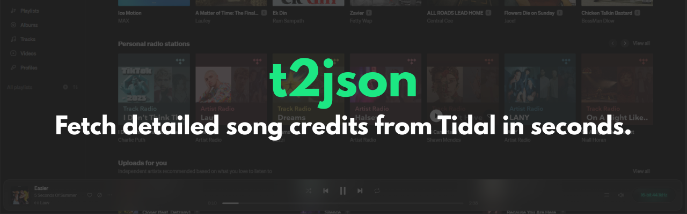
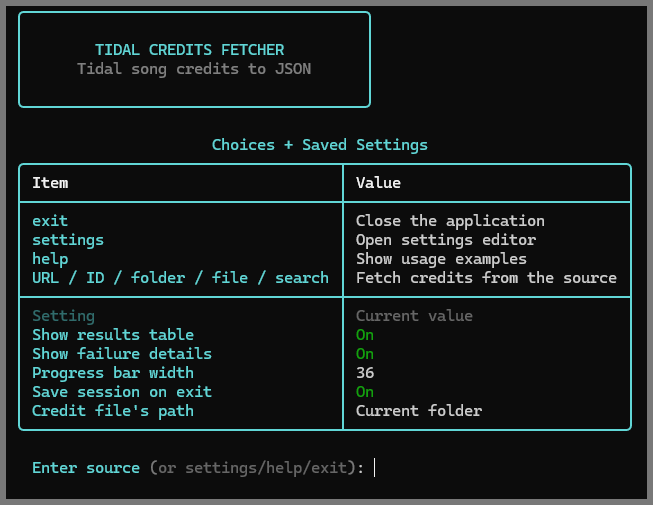
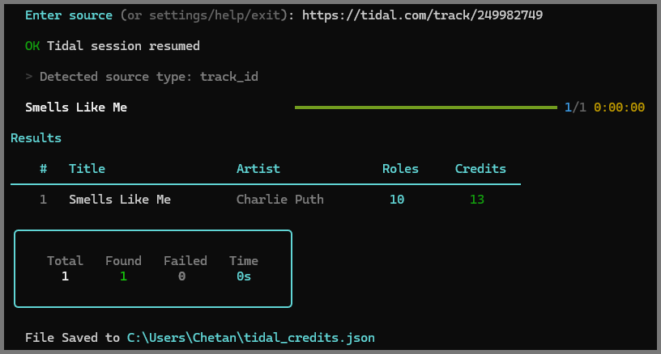

<p align="center">
  
</p>
<p align="center">
  
  <!--  -->
  
</p>

Note: This tool fetches metadata only. It does not download or distribute audio.

# t2json

A powerful CLI tool to fetch detailed song credits from Tidal and export them to JSON.

## ✨ Features

* Fetch credits by:

  * Track URL / ID
  * Album URL
  * Playlist URL
  * Search
  * Audio files (via ISRC)
  * Local folders
* Clean and structured JSON output (Kid3 compatible)
* Interactive CLI with progress bar and results table
* Persistent settings and session handling

## 📸 Preview

### CLI Demo


### Results Table


## 📦 Installation

```bash
pip install t2json
```

## 🚀 Usage

```bash
t2json
```

Or directly:

```bash
t2json "song name"
t2json https://tidal.com/browse/track/123
```

## ⚙️ Requirements

* Python 3.8+
* Tidal account (for API access)
* JSON Editor

## 📄 Output Example

```json
{
  "Title": "STAY",
  "Artist": "The Kid LAROI, Justin Bieber",
  "Producer": "Charlie Puth, Blake Slatkin",
  ...
}
```

## 🧠 About

Built for music enthusiasts, editors, and audio engineers who care about detailed metadata.

## ⚠️ Disclaimer

This tool is intended for educational and personal use only.

`t2json` does not host, store, or distribute any copyrighted content.
It simply fetches publicly available metadata (song credits) from Tidal.

This project is not affiliated with, endorsed by, or associated with Tidal.

Users are responsible for complying with Tidal's terms of service and all applicable laws.

